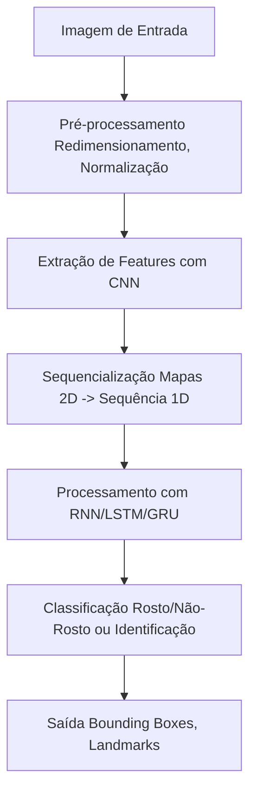

# Fluxo de Detecção Facial com RNN

```mermaid
flowchart TD
    A[Imagem de Entrada] --> B[Pré-processamento Redimensionamento, Normalização]
    B --> C[Extração de Features com CNN]
    C --> D[Sequencialização Mapas 2D -> Sequência 1D]
    D --> E[Processamento com RNN/LSTM/GRU]
    E --> F[Classificação Rosto/Não-Rosto ou Identificação]
    F --> G[Saída Bounding Boxes, Landmarks ]
```